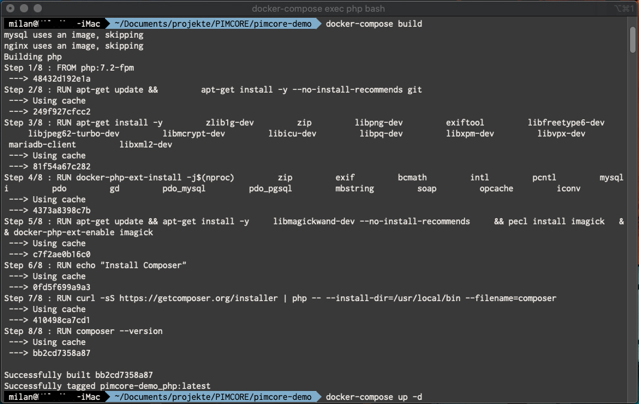
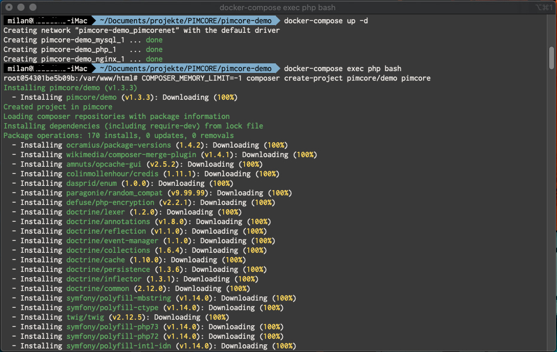
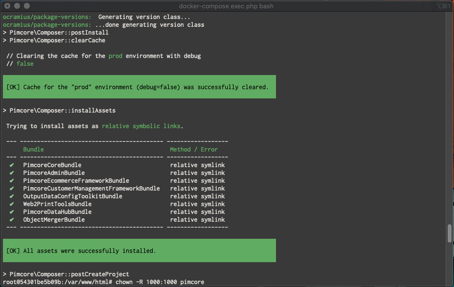
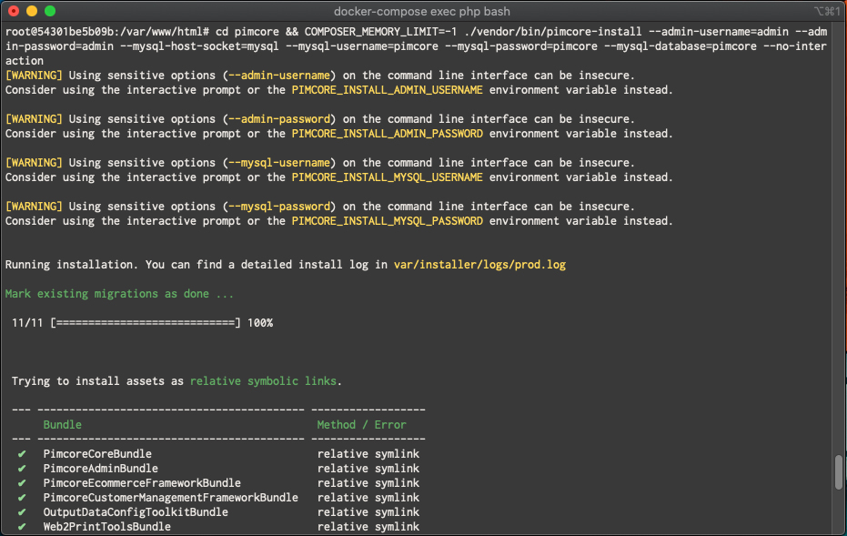
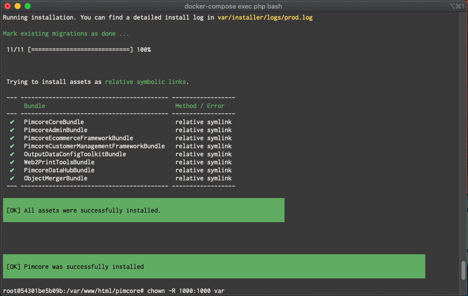
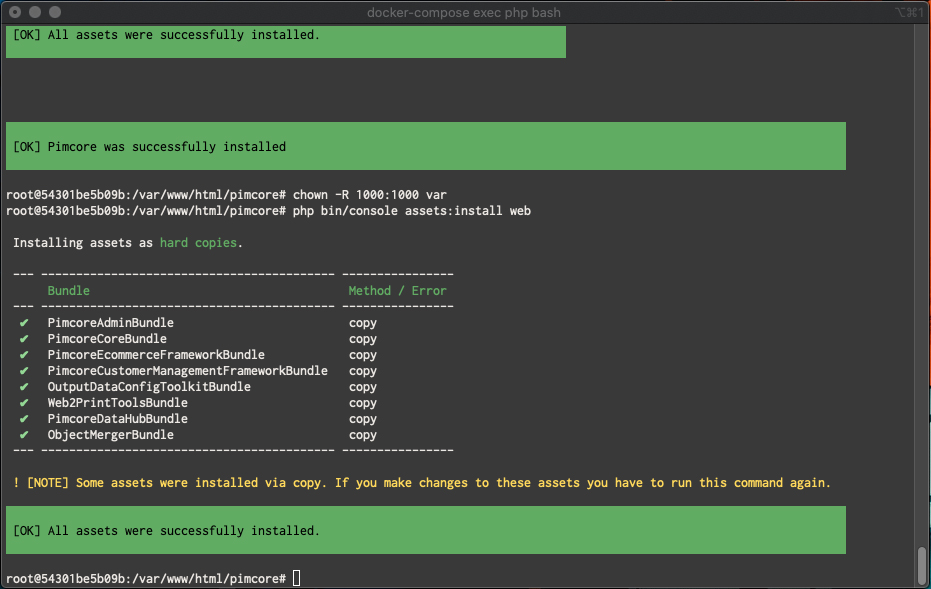

#

#

# pimcore-with-docker 🐳
   * 10 Steps to your Project with DOCKER. Easy setup for your pimcore local development enviroment.

1. ## 📂 Download DockerDesktop from docker hub
   * https://hub.docker.com/editions/community/docker-ce-desktop-mac/
   * register an Account and login into the App -> https://hub.docker.com/signup

2. ## 💾 Clone repository from GitHub
   * unzip the file
   * rename the folder similar to yout project name

3. ## 💻 Run Docker
   * open your Terminal (iTerm or whatever you like)
   * Go to root directory of the renamed folder -> $ cd /your-projects/project-name
   * run `docker-compose build` -> this will download the images
   * run `docker-compose up -d` -> this comand starts the docker container
   
   

4. ## 📖 Enter your docker container
   * run `docker-compose exec php bash`
   
   

5. ## ☁️ Install pimcore (see https://pimcore.com/de/download)
   * run `COMPOSER_MEMORY_LIMIT=-1 composer create-project pimcore/skeleton pimcore` or
   * run `COMPOSER_MEMORY_LIMIT=-1 composer create-project pimcore/demo pimcore` or
   * run `COMPOSER_MEMORY_LIMIT=-1 composer create-project pimcore/demo-basic-twig pimcore`[DEPRECATED]
   * run `COMPOSER_MEMORY_LIMIT=-1 composer create-project pimcore/demo-basic pimcore` [DEPRECATED]

The pimcore project structure will be created in the directory pimcore

6. ## 👥 Change owner for the pimcore directory.
   * run `chown -R 1000:1000 pimcore`
   
   

7. ## 📝 Create pimcore with admin user and database.
   * run `cd pimcore && COMPOSER_MEMORY_LIMIT=-1 ./vendor/bin/pimcore-install --admin-username=admin --admin-password=admin --mysql-host-socket=mysql --mysql-username=pimcore --mysql-password=pimcore --mysql-database=pimcore --no-interaction`

   * run `chown -R 1000:1000 var`
   * run `php bin/console assets:install web`
   
   
   
   
   
   

8. ## 📋 Access Pimcore 
   * pimcore frontend -> http://localhost:8080 
   * pimcore backend  -> http://localhost:8080/admin
   * user `admin`
   * pass `admin`

9. ## 🌅 OPTIONAL -> Generate Thumbnails
   * run `php bin/console pimcore:thumbnails:image`
   * run `chmod -R 777 web/var`

10. ## :clap: Congratulations! 🏁
